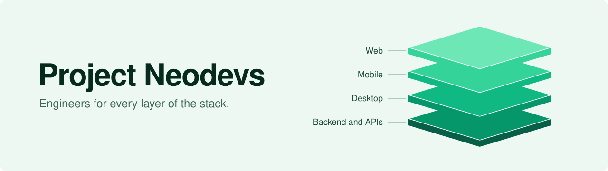

<picture>
  <source media="(prefers-color-scheme: dark)" srcset="./banner-dark.svg">
  
</picture>

## We got tired of class projects, so we started an agency

Project Neodevs is a team of computer engineering students in the Philippines. We run [CoeDevs](https://coedevs.vercel.app), a software engineering agency, and this organization is where its code lives.

Each of us owns one layer of the stack. A project gets a dedicated engineer for the frontend, another for the backend, another for mobile, rather than one person stretched across all of it.

## How a project runs

1. **Week one: architecture.** We map the system before writing it, so the build has no guesswork.
2. **Build.** A working, reliable system usually takes two to three weeks. Larger builds take a couple of months.
3. **Delivery.** Production-grade software, on the date we agreed.

## What we build

Web applications, mobile apps, desktop software, and the backend services and APIs behind them. Most days we work in React, TypeScript, Node.js, Firebase, Flutter, Python, Docker and AWS.

## Recent work

| Project | What it is | Built with | Links |
| --- | --- | --- | --- |
| **ApoTours** | Booking platform for Mt. Apo treks: trip catalog, multi-step booking, email confirmations, admin dashboard | Next.js, TypeScript, Firebase | [Code](https://github.com/Lianhahaha/MountainTourBooking) / [Demo](https://apotour.vercel.app/) |
| **Shop POS System** | Desktop point of sale for school supply and sari-sari stores: sales dashboard, receipts, role-based access, backup and restore | React, TypeScript, Tauri | [Code](https://github.com/Xyjor/Tito-POS-System) / [Demo](https://xyjor.github.io/Tito-POS-System/) |
| **CafePOS** | Offline-first point of sale and sales analytics for a cafe | Java, JavaFX | |
| **Peon** | Streaming web app with multi-server failover | React, Node.js, MongoDB | [Demo](https://owkayy.pages.dev/) |

The full list is on the [portfolio](https://coedevs.vercel.app/portfolio), and the people behind it are on the [team page](https://coedevs.vercel.app/team).

## Start a project

Tell us what you want to build at [projectneodevcoe@gmail.com](mailto:projectneodevcoe@gmail.com). We reply within 24 hours.
