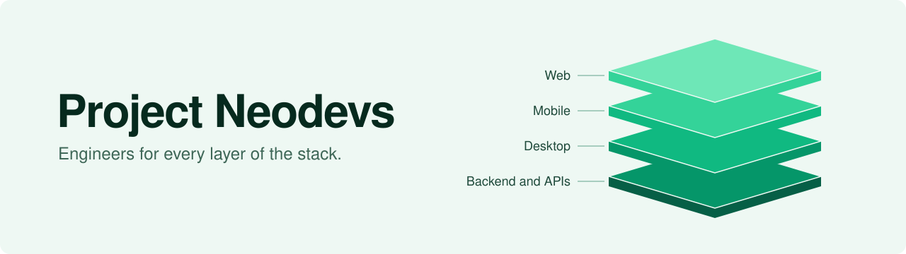

<picture>
  <source media="(prefers-color-scheme: dark)" srcset="./banner-dark.svg">
  
</picture>

Computer engineering students in the Philippines. We build web, mobile, and desktop apps, and the backends and APIs behind them. Client work runs through [CoeDevs](https://coedevs.vercel.app), our agency.

### How we work

- **One engineer per layer.** Frontend, backend, and mobile each have their own owner.
- **A live build every cycle.** You test working software on a real link, not screenshots.
- **You approve the release.** Nothing goes to production until you sign off.

### Start a project

Email [projectneodevcoe@gmail.com](mailto:projectneodevcoe@gmail.com) with what you want to build. We reply within 24 hours.
